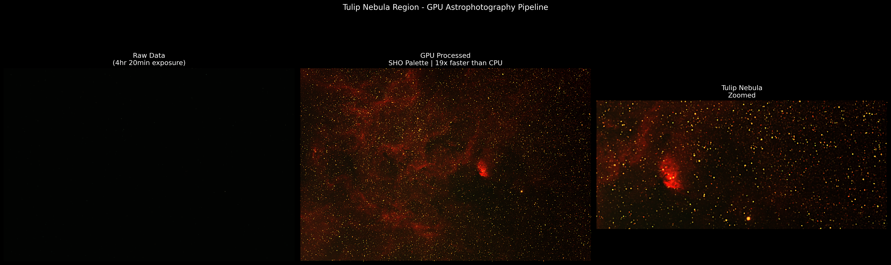

# GPU Astrophotography Pipeline
### Tulip Nebula | 4hr 20min Exposure | 19x GPU Speedup

A GPU-accelerated image processing pipeline for real narrowband astronomical data, built with CuPy and CUDA. Processes a 4176x6248 pixel Tulip Nebula exposure through histogram stretching, gamma correction, and unsharp masking — 19x faster than the equivalent CPU pipeline.

Built by someone who does astrophotography as a hobby and wanted to understand what happens computationally between raw telescope data and a finished image.

---

## The Problem

Raw narrowband telescope data looks like this:



The nebula is there. You just cannot see it. The pixel values are real photon counts from 4 hours and 20 minutes of exposure, but they are compressed into a tiny range that your monitor cannot display meaningfully. The pipeline's job is to reveal what the sensor captured.

---

## What the Pipeline Does

**1. Per-channel histogram stretching**
Each RGB channel is stretched independently from its 0.5th to 99.5th percentile. This maps the actual dynamic range of the data to the full 0-1 display range without letting a few bright stars dominate the stretch.

**2. Gamma correction**
Applies a power curve to the stretched data. Values above 1.0 darken the midtones, crushing the background to black while keeping bright nebula regions vivid. This is how you get that dramatic dark sky look.

**3. Unsharp masking**
Subtracts a Gaussian-blurred version of the image from itself, then adds the difference back. The result sharpens edges and brings out fine nebula filaments.

**4. SHO palette mapping**
Narrowband data captures specific emission lines rather than natural color. Channel weights are remapped to approximate the Hubble palette: red dominant, warm orange midtones, minimal blue.

---

## GPU vs CPU

| | CPU | GPU | Speedup |
|---|---|---|---|
| Full pipeline (20 iterations avg) | 0.1734s | 0.0091s | **19x** |

Benchmarked on Google Colab T4 GPU. The per-channel processing structure gives the GPU enough parallel work to overcome data transfer overhead.

---

## Stack

- **CuPy** — GPU array operations, drop-in numpy replacement
- **cupyx.scipy.ndimage** — GPU Gaussian filter
- **tifffile** — loads 32-bit float astronomical TIF format
- **numpy / scipy** — CPU baseline for benchmarking
- **matplotlib** — visualization

---

## Run It

```bash
pip install cupy-cuda12x tifffile scikit-image matplotlib numpy scipy
```

Add your own TIF file and update the filename in `pipeline.py`:

```bash
python pipeline.py
```

---

## The Data

The source image is a 4 hour 20 minute narrowband exposure of the Tulip Nebula region in Cygnus, captured in hydrogen-alpha. The Tulip Nebula (Sh2-101) is an emission nebula approximately 6,000 light years away. The bright compact region visible in the zoomed panel is the Tulip itself, surrounded by a wider field of ionized hydrogen gas filaments.

Data is sourced from : https://astrobackyard.com/your-astrophoto-skills/

---

*Built by Nawfal Mansoor Lodhi | [github.com/nawfallodhi](https://github.com/nawfallodhi) | [linkedin.com/in/nawfal-lodhi](https://linkedin.com/in/nawfal-lodhi)*
